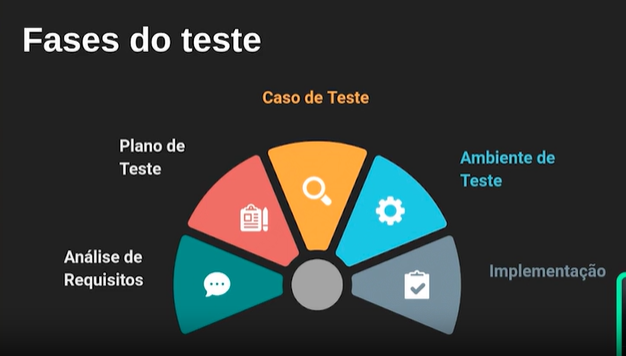

# CULTURA DE TESTE

## TDD
Test Driven Development (TDD), ou Desenvolvimento Orientado por Testes, é uma metodologia de desenvolvimento onde os testes são escritos antes do código funcional. O ciclo TDD é geralmente descrito em três etapas:

*   Red (Vermelho): Escrever um teste que falha, pois a funcionalidade ainda não foi implementada.
*   Green (Verde): Escrever o código mínimo necessário para fazer o teste passar.
*   Refactor (Refatoração): Melhorar o código, mantendo todos os testes passando.

O ciclo é então repetido para cada nova funcionalidade ou correção de bug. Os benefícios do TDD incluem:

*   Melhor design de código: Força os desenvolvedores a pensar sobre os requisitos e design antes de escrever o código.
*   Menos bugs: A detecção precoce de problemas reduz a quantidade de bugs em produção.
*   Manutenção facilitada: O código tende a ser mais modular e testável, facilitando a manutenção futura.
*   Confiança no código: Com uma suíte de testes abrangente, os desenvolvedores têm mais confiança ao fazer alterações no código.

TDD é uma metodologia que envolve escrever testes antes de implementar a funcionalidade, promovendo um desenvolvimento mais robusto e confiável.

## Tipos de Testes

## UNIT TESTS

Testes Unitários são uma prática de desenvolvimento de software onde partes individuais de uma aplicação, chamadas de unidades, são testadas isoladamente para garantir que funcionam conforme o esperado. Uma unidade pode ser uma função, um método ou um módulo. O objetivo dos testes unitários é verificar se cada parte da aplicação funciona corretamente, de forma independente das demais partes.

Os testes unitários são importantes por várias razões:

*   Verificação de funcionalidade: Garantem que cada parte do código funcione como esperado.
*   Facilitam a manutenção: Quando mudanças são feitas no código, os testes podem ajudar a identificar rapidamente se alguma funcionalidade foi quebrada.
*   Documentação: Servem como uma forma de documentação do comportamento do código.
*   Refatoração segura: Permitem que os desenvolvedores refatorem o código com confiança, sabendo que qualquer erro introduzido será detectado pelos testes.

## INTEGRATION TEST

Os testes de integração são um tipo de teste de software focado em verificar a interação entre diferentes módulos ou componentes de um sistema. Eles garantem que, quando combinados, esses módulos funcionem corretamente em conjunto, conforme especificado.

### Objetivo dos Testes de Integração
*   Verificar a Comunicação Entre Módulos: Certificar-se de que os módulos de software interajam corretamente.
*   Detectar Problemas de Interface: Identificar problemas nas interfaces entre componentes.
*   Garantir a Integração Funcional: Assegurar que componentes integrados mantenham a funcionalidade esperada.

### Características dos Testes de Integração
*   Interação de Módulos: Testam a interação entre duas ou mais unidades de código.
*   Uso de Dependências Reais ou Mockadas: Podem usar dependências reais (banco de dados, APIs externas) ou mocks/stubs.
*   Cobertura de Fluxos de Trabalho: Cobrem fluxos de trabalho que envolvem múltiplos componentes.

### Benefícios dos Testes de Integração
*   Identificação de Problemas de Interface: Detectam problemas na comunicação entre componentes.
*   Garantia de Funcionamento Conjunto: Asseguram que os componentes funcionem corretamente quando integrados.
*   Cobertura de Casos de Uso Reais: Validam fluxos de trabalho reais da aplicação, cobrindo cenários complexos.

## E2E

Os testes End-to-End (E2E) são uma forma de teste de software que verifica o comportamento de uma aplicação completa do início ao fim tanto do BackEnd quanto do FrontEnd. O objetivo dos testes E2E é garantir que o fluxo de uma aplicação funcione conforme o esperado, validando a integração de todos os componentes e subsistemas, desde a interface do usuário até o banco de dados e back-end.

### Características dos Testes E2E
*   Cobertura Completa: Testam todo o fluxo de trabalho da aplicação, garantindo que todas as partes do sistema funcionem juntas como esperado.
*   Simulação de Ambiente Real: Executam testes em um ambiente que simula o mais próximo possível o ambiente de produção.
*   Automação: Normalmente, são automatizados para facilitar a execução frequente e a validação contínua.

### Benefícios dos Testes E2E
*   Detecção de Problemas de Integração: Ajudam a identificar problemas que ocorrem na interação entre diferentes componentes do sistema.
*   Garantia de Funcionalidade: Validam que a aplicação atende aos requisitos funcionais e proporciona a experiência esperada ao usuário final.
*   Cobertura Abrangente: Cobrem cenários complexos que não são facilmente testados com testes unitários ou de integração.

### Processo de Teste E2E
*   Setup: Configure o ambiente de teste para simular o ambiente de produção.
*   Escrita dos Testes: Escreva os testes para cobrir os principais fluxos de trabalho e cenários de uso da aplicação.
*   Automação: Utilize ferramentas para automatizar a execução dos testes.
*   Execução: Execute os testes regularmente, especialmente durante o desenvolvimento e antes de releases.
*   Análise: Analise os resultados dos testes para identificar e corrigir problemas.

## Estratégias:
*   Desenvolvimento Orientado a Testes (TDD): Escrever testes antes do código de produção.
*   Integração Contínua (CI): Automatizar a execução de testes em cada commit ou merge.
*   Deploy Contínuo (CD): Automatizar a implantação de novas versões após a aprovação nos testes.
*   Cobertura de Código: Medir a porcentagem de código que é coberta pelos testes.
*   Cobertura de Funcionalidade: Garantir que todas as funcionalidades principais do software sejam testadas.

## Ferramentas de teste que esta sendo utilizada no projeto:

Cada uma dessas ferramentas tem seus próprios pontos fortes e é adequada para diferentes tipos de testes. A escolha da ferramenta correta depende das necessidades específicas do projeto e dos requisitos de teste. Aqui está um resumo rápido:

*   Jest: Ótimo para testes unitários e de integração.
*   Cypress: Testes E2E para aplicações web.
*   Selenium: Testes E2E em múltiplos navegadores.
*   Apache JMeter: Testes de carga e desempenho.
*   Autocannon: Testes de performance e medir a capacidade de resposta