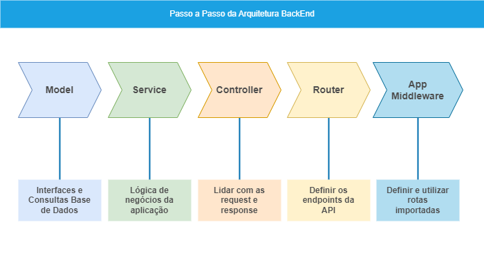

# Pasta `src`
Contém os arquivos principais de configuração e inicialização da aplicação.

## Estrutura da Pasta

```
dist/
├── controllers/
│ ├── UserController.ts
│ └── ...
├── lang/
│ ├── pt-br.ts
│ └── en-un.ts
├── models/
│ ├── interfaces/
│   ├── IUser.ts
│ └── modelUser/
│   ├── User.ts
│   ├── UserAttributes.ts
│   ├── UserMethods.ts
├── routes/
│ ├── userRoutes.ts
│ └── ...
├── services/
│ ├── UserService.ts
│ └── ...
├── config/
│ ├── Config.ts
│ └── ...
└── index.ts
└── app.ts
└── server.ts

```



### Models - Interfaces
Os Models representam a estrutura dos dados e são responsáveis por interagir diretamente com o banco de dados. Eles contêm as definições das entidades e os métodos para acessar e manipular esses dados, para isso estamos utilizando a biblioteca de conexão com banco de dados ```Sequelize```. Além de conter as interfaces que descrevem a estrutura dos dados usados na aplicação, facilitando o uso do TypeScript para tipagem estática. 

*   OBS: Importante implementar tratativa de Rollback das query de ``` INSERT ```, ``` UPDATE ``` e ``` DELETE ``` em casos de erros, isso é uma boa pratica de desenvolvimento pois assim evita persistir dados inválidos no banco.

*   [Sequelize - Documentação Geral Model](https://sequelize.org/docs/v6/core-concepts/model-basics/)

```

├── models/
│ ├── interfaces
│ │ └── IUser.ts
│ └── modelUser
│ │ └── User.ts                            -- Montar a estrutura da tabela
│ │ └── UserAttributes.ts                  -- Definir os atributos das colunas da tabela
│ │ └── UserMethods.ts                     -- Criar os métodos de retorno. 


```

### Services
Os Services contêm a lógica de negócios da aplicação. Eles são responsáveis por coordenar as operações entre os Controllers e os Models.

### Controllers
Os Controllers são responsáveis por lidar com as requisições do usuário, interagir com os Services e retornar a resposta apropriada. Eles atuam como intermediários entre as requisições HTTP e os serviços que contêm a lógica de negócios.

### Routes
As rotas definem os endpoints da API e associam esses endpoints aos métodos dos Controllers correspondentes.

### Arquivo index.ts
Este arquivo é responsável por gerenciar os processos do servidor, utilizando o módulo cluster para balanceamento de carga e melhoria de performance.
*   runPrimaryProcess: Função que cria processos filhos com base na quantidade de núcleos da CPU, para fazer um balanceamento da aplicação para melhor performance em ambientes caóticos.
*   runWorketProcess: Função que importa e executa o arquivo server.ts para iniciar o servidor.

### Arquivo server.ts
Este arquivo configura o servidor HTTP e lida com eventos do processo, como sinais de término e exceções não tratadas.
*   server: Cria e inicia o servidor HTTP.
*   process.on: Lida com sinais de término (sigterm) e erros não tratados (uncaughtException e unhandledRejection), assim evitando que a aplicação pare caia.

### Arquivo app.ts
Este arquivo configura o aplicativo Express, incluindo middlewares, rotas e tratamento de erros.
*   Middlewares: Configurações de CORS, logging, parsing de body e cabeçalhos.
*   Rotas: Define e utiliza rotas importadas.
*   Tratamento de Erros: Lida com erros 404 (Not Found) e outros erros desconhecidos.

### config
Contém arquivos de configuração que são usados em várias partes da aplicação. Também contém as informações de conexão com a base de dados, neste projeto estamos utilizando a biblioteca ```Sequelize``` para conectar com a banco de dados. Essa biblioteca é útil por não precisar utilizar querys de forma direta onde a própria biblioteca já faz isso por traz dos panos. Além disso ela permite migrar entre banco de dados de forma fácil e descomplicada onde é necessário mudar somentes algumas informações presente no arquivo .env como dados de conexão com o banco de dados e nome da biblioteca da base de dados que vai ser utilizada, segue exemplo de possiveis bibliotecas de banco de dados que podem ser utilizadas em conjunto com ```Sequelize```: ``` mysql | postgres | sqlite | mariadb | mssql | db2 | snowflake | oracle ```. Alem disso o Sequelize garante que a estrutura do banco de dados seja sempre a mesma para todos os devs por meio da funcionalida migrations, para isso é necessario criar uma nova migration sempre que fazer alguma alteracao no banco de dados como por exemplo criar uma nova tabela. Para criar essa migration e necessario executar o comando: 

```npx sequelize-cli migration:generate --name add-new-column-to-users``` 

Esse comando vai criar uma nova migration no caminho ```BackEnd/src/config/dataBase/migrations/``` em seguida basta colocar as alterações que vao ser feita no banco no arquivo que foi criado, como no exemplo abaixo foi feito uma migration para criar uma nova tabela chamada ```exemplo```:

```js
'use strict';

/** @type {import('sequelize-cli').Migration} */
module.exports = {
  async up (queryInterface, Sequelize) {
    return queryInterface.createTable('exemplo', {
      id: {
        type: Sequelize.INTEGER,
        primaryKey: true,
        autoIncrement: true,
        allowNull: false
      },
      name: {
        type: Sequelize.STRING,
        allowNull: false
      },
      idade: {
        type: Sequelize.INTEGER,
        unique: true,
        allowNull: false
      },
      altura: {
        type: Sequelize.DOUBLE,
        allowNull: true
      },
      peso: {
        type: Sequelize.DOUBLE,
        allowNull: true
      },
      empregado: {
        type: Sequelize.TINYINT,
        allowNull: true
      },
      data_nascimento: {
        type: Sequelize.DATE,
        allowNull: true
      },
      createdAt: {
        type: Sequelize.DATE,
        allowNull: true
      },
      updatedAt: {
        type: Sequelize.DATE,
        allowNull: true
      }
     })
  },

  async down (queryInterface, Sequelize) {
    return queryInterface.dropTable('exemplo');
  }
};
```
Para executar essa migration basta abrir o terminal e digitar o comando: 

```npm run db:migrate``` 

Apos feito isso o sistema vai verificar todas as migration que esta pendente e criar as tabelas no banco de dados, assim garantindo que todos os devs tenha a mesma estrutura do banco de dados. No banco de dados existe uma tabela chamada SequelizeMeta essa tabela armazena as migration que foram executadas, assim garantindo que nao execute uma migration mais de uma vez.

*   [Sequelize - Documentação de Conexão com banco](https://sequelize.org/)


